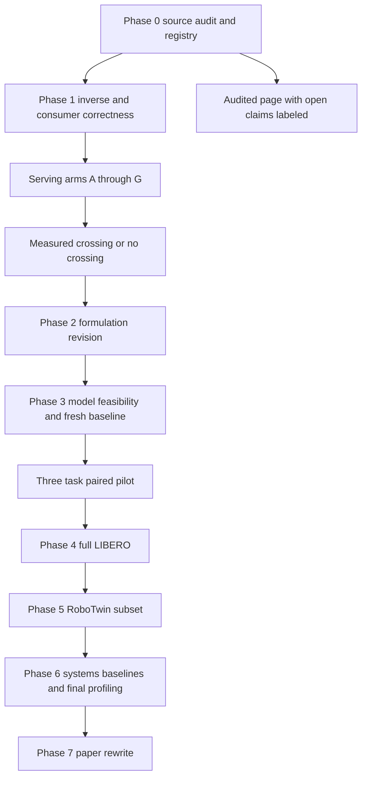

# Execution plan and acceptance gates

The first code-changing step followed the user-visible ten-part audit. Existing source remains immutable. Only lightweight artifact reanalysis and a bounded CPU implementation study are authorized to run before full provenance closure. Phase 2 and later material in this package is preparation, not a claim that those experiments have been executed out of order.

## Dependency graph

## Phase 0

Recover source commits, commands, raw feature caches, sequence lists/splits, checkpoint and decoder hashes, per-frame outputs, simulator traces and original power samples. Recompute every claim through the registry. Separate reproduction from retrospective statistics. For H1 run both within-sequence time shuffle and cross-sequence independent prior under the same fitted decoder and test sequences. Report absolute loss as well as normalized loss. The old 18-claim family remains unverified until its complete raw/corrected p table and sampling units are recovered.

GO: every retained headline has an identifiable data-generating protocol and a source-based figure. STOP: estimates combine different normalization or sampling units, or a figure has no generating table. Unsupported headlines may be removed while the narrower artifact report proceeds.

## Phase 1

Arms A canonical producer/direct serving; B hidden permutation diagnostic; C raw permuted + inverse materialization per read; D raw permuted + tiled indirect consumer; E canonicalize on write; F one canonical store plus per-consumer adapters; G consumer-specific replicated layouts. A is an upstream-canonical reference, not a fair free-conversion competitor to a scrambled producer. E/F/G and C/D must receive the same incoming bytes for fair write-plus-reuse comparisons. Store metadata with its actual codec and measure deserialization/map construction separately. Retain CPU index-array bytes and device map bytes separately.

Before profiling, verify payload inverse bitwise for pure permutation and fixed consumer output within predeclared absolute/relative tolerance. The learned reader is fixed across A/C/D/E/F/G; representation-specific refitting is a separate experiment. Use a sequence-varying hidden map for B and report its scope. Layout transformations must include transpose, block/tiling and arbitrary permutations; pooling belongs in another experiment.

Minimum sweep: payload approximately 1 KB to 64 MB (log grid); ranks 8/16/64/384; spatial cells 36/144/1024/4096 subject to RAM; F=1,2,4,8,16,32,64,128; consumers 1/3 and multitenant skew 10/50/90%; read/write mix derived from F plus explicit mixed traces; working sets hot-small, LLC-scale and beyond LLC; CPU and CUDA. Factorial products exceeding feasibility are staged and logged; do not silently omit the requested axes.

Use at least 20 independently repeated run blocks for final timing; randomized arm order within blocks, fixed input traces, warmup excluded, pin threads where supported, record load/temperature/frequency/power settings and driver/runtime. Save each operation latency and each repetition. Report median across blocks with CI, per-run p50/p95/p99 summarized across blocks, throughput, peak allocations, actual persistent metadata and payload bytes. Define wall request-to-result versus device kernel time separately. Observe DRAM traffic/cache misses/memory transactions with available hardware profilers; unavailable metrics are null, never estimated as measured.

For energy integrate sufficiently long randomized workload blocks with timestamped device/CPU power and matched idle blocks; prefer cumulative energy counters when available. Report gross and idle-subtracted energy, sampling resolution, measurement domain and uncertainty. Account for sensing and the rest of the machine separately. Device average energy is not whole-system energy. GPU events require synchronization appropriate to the reported latency. CPU cache state is an experimental condition, not an assumption based on payload size alone.

Generate reuse-versus-size phase diagrams for one consumer, three consumers and multitenant traffic. Colors encode lower measured total cost only when CI and practical threshold support a distinction; otherwise unresolved. Plot latency and energy separately, with memory infeasibility masked. Measure at each F, fit affine models only if residuals support them. No crossing is a valid outcome. If reindex is equivalent within a predeclared practical margin throughout, downgrade physical-layout preservation from a main optimization axis.

## Phase 2

Finalize `THEORY_REVISED.md` only after costs stabilize. Account for producer layout, acquisition time, metadata, copy lifetime and per-sensor age. Demonstrate any equivalent-age simplification from its actual assumptions. Do not collapse an accuracy constraint into “pick smallest error” or infer a three-way selector from a two-way inequality.

## Phase 3

First use pinned Cosmos Policy and its LIBERO checkpoint; verify baseline success, precision, camera transformations, action normalization, image orientation, proprioception and prediction horizon. Record memory and timing for action-only and action+future+value separately. The published model score is a reproduction target, not a locally measured baseline.

Pilot: one Spatial, one Object, one Goal/Long task selected before outcome inspection; 40 paired initial conditions per task (within requested 30–50), 10 arms, both synchronous and latency-aware semantics = 2400 attempted episodes. Seeds are nested in task, not 2400 independent tasks. Three tasks are a feasibility sample with weak between-task precision; do not claim broad task generalization from it.

Arms: fresh each decision, stale retrieve, TTL, global fixed fidelity, FRAME preserve, FRAME reindex, no consumer conditioning, no imagination, lightweight predictor, learned imagination. Specify shared model/decoder, fidelity ladder and policies precisely; avoid arms that differ only in labels. A DINO feature cannot be fed to an RGB-trained Cosmos policy without a justified adapter. Begin with RGB fidelity and reversible layout adapters at the observation boundary, then separately evaluate latent-native serving if a checkpoint-compatible interface exists.

Memory wrapper: acquire only when selected, record all field timestamps, keep action-conditioned predictions and actual action history, choose consumer requirements from policy-visible information only, adapt stored layout, invoke model, execute its chosen action chunk, advance simulator and log observation/decision/action hashes. Simulator truth is isolated in the scorer. An observer that computes new images in every branch and then hides them can be acceptable for scoring but must not feed them or their timing-dependent features to the selector. Disclose any always-on proprioception and sensing costs.

Synchronous mode follows official benchmark semantics. Latency-aware mode advances physical state during conversion, inference and sensing, using either a decoupled simulator clock or an explicitly labeled assigned-delay simulation with a stable wall-to-sim mapping. Specify action-hold/last-command behavior while waiting. Report modified dynamic environments separately from standard LIBERO. Match timebases: 20 Hz control, simulator dt and camera rate are not interchangeable. Sensing timestamps precede transmission/inference; reobserve is not automatically perfectly current.

GO: fresh baseline within a predeclared reasonable tolerance of task-matched reference; no systematic reset drift; action intervention visibly changes executed action values (not just episode length); no truth leakage; all arms share model/decoder; stable timing; successes/failures enough for estimation. STOP and diagnose saturated or uniformly failed arms, OOM, decoder mismatch, insufficient perturbation, or latency that never reaches the dynamics. Never select difficult tasks after seeing FRAME improvements.

## Phase 4 and 5

Full LIBERO only after pilot. Use tasks as the generalization unit, paired initial states and nested seeds. Equal-task success difference and task-cluster CI are primary. Record steps/time to success, censored failure durations, action disagreement, sensing/imagination counts, age, deadline misses, future/latent error, optional value calibration, memory, byte traffic, latency components and energy per attempt/per success.

RoboTwin: 5–10 fixed representative tasks for pick/place, open/close, coordinated bimanual motion, handover and multistage behavior. Pin actual task IDs from the installed version before evaluation. A Panda/LIBERO checkpoint does not automatically serve bimanual RoboTwin actions; require a matching learned policy/world-model checkpoint or document fine-tuning cost. Custom SAPIEN pushing is not a replacement. AI2-THOR remains out of scope unless a navigation claim is pursued.

## Phase 6

LRU, LFU, 2Q or ARC, size-aware and frequency-size policies, global/per-consumer fixed fidelity. Identical capacity, key traces, read/write decisions, consumer mix, miss service and representation cost. Cache metadata and replicated tensors count against budget. Assert resident bytes never exceed capacity, writes modify stored values, evictions actually occur, and stale copies are invalidated. Report measured distortion using the actual served tensor instead of only composing averaged hit/error tables. Keep such composition as a labeled model if used.

## Statistics and scaling

Lock H1–H4 endpoints and practical margins before collecting confirmatory data. Use independent streams for environment initialization, external disturbances, model sampling and arm order; pair the applicable streams, without coupling them through different numbers of RNG calls. Hierarchical bootstrap samples tasks then paired seeds within sampled tasks, preserving all arms. Mixed-effects logistic models require enough tasks and checked convergence; with 3 tasks inference is descriptive/feasibility. Holm correct the declared confirmatory family. Treat multiple hardware/cost endpoints as an explicitly nested family or a fixed conjunction, not free multiple testing. Report effect size, CI, raw p and adjusted p; no repeated unplanned peeking.

A complete Pareto claim needs non-inferior task success and demonstrably improved resource cost at predefined settings, including dominated and failed points. Task success superiority alone is not required when equal performance uses less resource. Determine sample size by simulation from pilot variability and minimum meaningful effects, not a universal 30-seed rule.

## Compute planning

These are estimates, not completed runtime measurements: Phase 0 hours to days depending on missing artifacts; CPU smoke minutes; controlled Phase 1 1–3 days; model setup 1–3 days; pilot 2400 episodes. At an assumed 1–5 minutes per episode, serial pilot cost is 40–200 device-hours plus repeats and instrumentation. Replace that assumption with measured baseline time before allocation. Full LIBERO is roughly 40/3 times the three-task pilot at equal episodes/settings, before throughput gains; do not launch that multiplier automatically. RoboTwin adds days to weeks of integration risk. Final systems experiments and paper rewriting require several additional days after data stabilize.

## First ten implementation actions

1. Preserve and hash all supplied/adjacent evidence.
2. Register exact headline prose with figure/table and script references.
3. Separate normalization estimands and resolve version discrepancies.
4. Recompute paired video CIs and explicit test families.
5. Generate numeric figures and check rendered-table references against the registry.
6. Account actual serialized/resident/temporary metadata and copies.
7. Implement A–G correctness and a small CPU smoke benchmark.
8. Store raw timing blocks and generate cost-difference diagrams with uncertainty.
9. Prepare pilot configuration, model feasibility record, trace/observation contracts and scale gates.
10. Deliver the corrected project-page files and evidence package; leave future results visibly unmeasured.

At every phase append: WHAT WAS TESTED / WHAT WAS FOUND / WHAT CLAIM SURVIVES / WHAT CLAIM MUST CHANGE / WHAT REMAINS UNRESOLVED / NEXT EXPERIMENT. Each run directory must include config, commit/checkpoint hashes, raw output, processed table, plot script, figure and statistical report, or explicitly record why an output is unavailable.

## 2026-09-07 execution amendment

The user subsequently authorized remote server experiments and training. This supersedes the initial local-only execution scope in the opening paragraph. `SERVER_EXECUTION.md` and machine-readable raw manifests record actual Slurm jobs. Original source/cache readout reproduction has completed. CPU/GPU serving has been expanded to an exploratory deployment study; this is still smaller than the proposed final matrix and uses eleven run blocks. It must not be described as the final twenty-block confirmatory study. GPU F now uses fused adapters, matching D's optimization opportunity. Final H3 comparisons must include both materializing and fused paths.

Real-model feasibility was checked early while layout runs were executing, to identify an infrastructure dependency before allocating model training. This read-only setup work is the only scheduling exception: no model training or benchmark sweep bypassed the Phase 1–2 gates. The requested large-scale training remains gated by a supported runtime, a task-matched fresh baseline and a successful memory-intervention pilot.

## Conditional campaign and visualization protocol

`configs/conditional_campaign.json` specifies the independent factors, counterexamples, endpoints and gates for H1–H4. It is a registered experiment design, not a record of completed experiments. The large H3 product is screened in stages; selected boundary points require new independent runs. The 2,400-episode H4 pilot remains gated by calibrated memory decisions and intervention correctness. Sample size for task generalization is determined from task-level variation; three smoke episodes do not provide that estimate.

The first learned-model visualization includes every preselected smoke task. Columns use aligned observation, generated future, realized future, pixel residual, patch residual and residual overlay. All rows use the same residual scale. Exclude terminal partial action chunks from fixed-horizon comparisons and report that exclusion. These residuals are calculated after the future is observed and cannot be inputs to the runtime selector. Predicted confidence requires a separate learned/calibrated model and held-out calibration results.

The follow-up intervention check compares fresh, stale, fixed TTL and TTL with exact inverse layout on the same three initial states. It is an exploratory causal sanity check before the 40-state pilot. Do not label TTL as FRAME or claim that a three-state result establishes a task-resource frontier. Rendering currently occurs inside the simulator driver for every step; this cannot establish sensing-energy savings.
